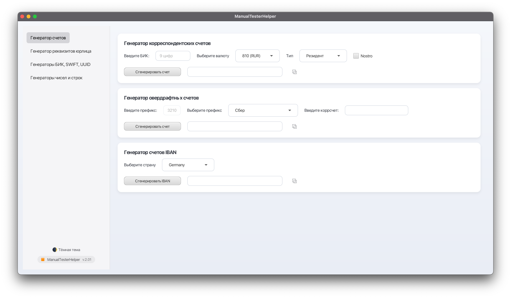
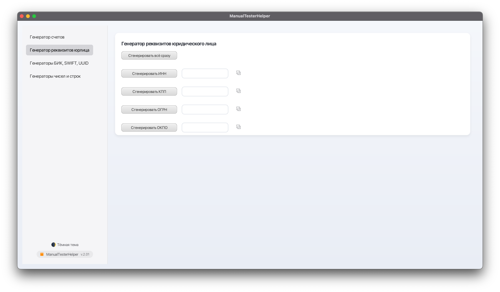
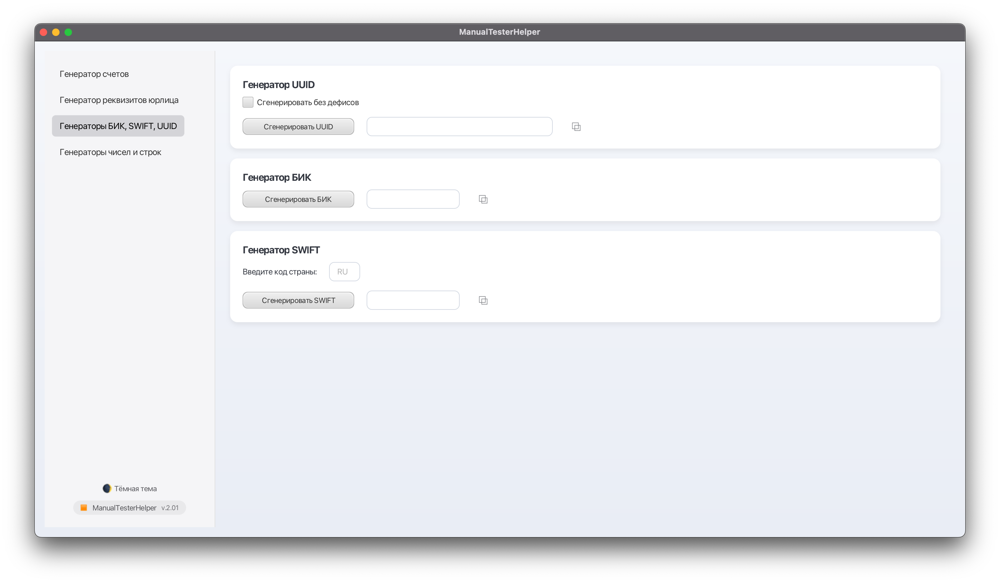
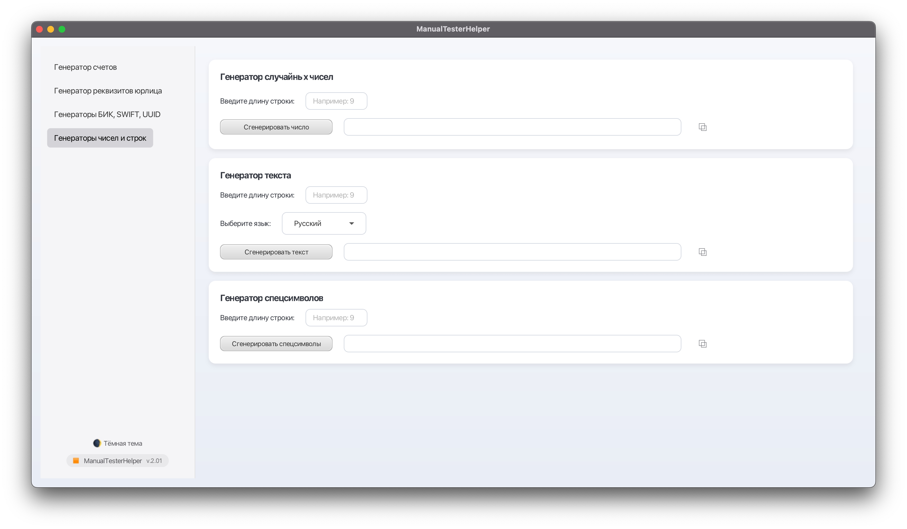

# 🧰 ManualTesterHelper



<p align="center">
  
  
  
</p>

[](https://www.oracle.com/java/)
[](https://openjfx.io/)
[](https://gradle.org/)
[](LICENSE)

## ⚠️ Disclaimer

All data generated by ManualTesterHelper (INN, KPP, OGRN, OKPO, BIC, IBAN, SWIFT, account numbers, etc.)  
are **synthetic test values**. These identifiers **do not correspond to real organizations or banks**  
and must **not** be used in production systems or financial operations.  
Their purpose is **testing, demonstration and educational use only**.

Все данные, генерируемые ManualTesterHelper, являются **синтетическими тестовыми значениями**  
и не предназначены для использования в реальных сервисах или документах.  
Совпадения с реальными организациями случайны.

---

[🇷🇺 Русская версия](#-русская-версия) | [🇬🇧 English version](#-english-version)

---

## 🇬🇧 English version

**ManualTesterHelper** is a JavaFX desktop application that helps manual testers quickly generate various types of test data.  
The project supports generating Russian legal entity identifiers (INN, KPP, OGRN, OKPO, KIO, BIC, SWIFT, correspondent accounts), as well as random numbers and strings.

---

### 🚀 Features

- Generate legal entity details: INN, KPP, OGRN, OKPO, KIO, BIC, SWIFT, and correspondent accounts.
- Generate random numbers and strings.
- Built-in validation of input fields (length, digits only, etc.).
- Visual highlighting of errors without affecting layout.
- Cross-platform: works on Windows and macOS.

---

### 🧩 Technologies

- **Language:** Java 21
- **UI Framework:** JavaFX 23 (FXML + CSS)
- **Build System:** Gradle 8
- **Architecture:** Modular (`module-info.java`)
- **Custom Controls:** `LimitedTextField`
- **Utilities:** `Validators`, `UiErrorsProcessing`

---

### ⚙️ Build and Run

#### 🪟 Windows

1. Open a terminal in the project root.
2. Run the command:
   ```bash
   gradlew clean build prepareWinDist
   ```
3. After the build completes, the folder `build/win-dist` will contain:
   - `app.jar`
   - `lib/javafx/` — JavaFX runtime libraries for Windows
4. Launch the app with:
   ```bash
   java --module-path "lib/javafx" --add-modules javafx.controls,javafx.fxml -jar app.jar
   ```
---
#### 🍏 macOS

1. Make sure **JDK 21+** and **Gradle 8+** are installed.
2. To build and run the app:
   ```bash   
   ./gradlew clean build run
   ```

3. To build only the JAR file:
   ```bash
   ./gradlew clean build
   ```

4. To run manually with JavaFX SDK (if not globally installed):
   ```bash
   java --module-path "/path/to/javafx-sdk-23/lib" --add-modules javafx.controls,javafx.fxml -jar build/libs/app.jar
   ```

---

### 📜 License

Distributed under the **MIT License**.  
Author: [Evgeny Lyashchuk](https://github.com/RoyalSpirit)  
Source: [ManualTesterHelper on GitHub](https://github.com/RoyalSpirit/ManualTesterHelper)

---

## 🇷🇺 Русская версия

**ManualTesterHelper** — настольное JavaFX-приложение, упрощающее ручное тестирование.
Позволяет быстро **генерировать тестовые данные**: ИНН, КПП, ОГРН, БИК, SWIFT, корреспондентские счета, случайные строки и числа.

---

## 🚀 Возможности

- Генерация реквизитов юридических лиц (ИНН, КПП, ОГРН, ОКПО, КИО, БИК, SWIFT, корр. счёт).
- Генерация случайных чисел и строк.
- Автоматическая проверка длины и формата вводимых данных.
- Кроссплатформенная сборка (Windows / macOS).

---

## 🧩 Технологии

- **Java 21**
- **JavaFX 23**
- **Gradle 8**
- Модульная архитектура (`module-info.java`)
- FXML + CSS
- Собственные кастомные контролы (`LimitedTextField` и др.)

---

## 📂 Структура проекта

src/\
├─ main/\
│ ├─ java/\
│ │ └─ demo/\
│ │ ├─ App.java # точка входа (JavaFX Application)\
│ │ ├─ ui/ # FXML, контроллеры\
│ │ ├─ controls/ # кастомные JavaFX-компоненты\
│ │ ├─ service/ # фасад для генераторов\
│ │ ├─ generators/ # логика генерации данных\
│ │ ├─ domain/ # enum'ы и модели\
│ │ └─ util/ # утилиты и валидаторы\
│ └─ resources/\
│ └─ demo/ui/ # FXML и CSS\
│\
└─ build.gradle # скрипт сборки и дистрибуции

---

## ⚙️ Сборка проекта

### 📍 Требования
- **JDK 21+**
- **Gradle 8+**
- Подключённая **JavaFX SDK 23**

---

### 🪟 Windows

1. Открой терминал в корне проекта.
2. Выполни:
   ```bash
   gradlew clean build prepareWinDist
   ```
   
3. После сборки появится папка:

   build/win-dist/\
   ├─ app.jar\
   └─ lib/javafx/   ← сюда Gradle сложит winRuntime-версии JavaFX

4. Запуск приложения:
   ```bash
   java --module-path "lib/javafx" --add-modules javafx.controls,javafx.fxml -jar app.jar
   ```
   
---

### 🍏 macOS

1. Открой терминал в корне проекта.
2. Для сборки и одновременного запуска приложения выполни:
   ```bash
   ./gradlew clean build run
   ```
3. Чтобы собрать только JAR-файл без запуска, выполни:
   ```bash
   ./gradlew clean build
   ```
   Готовый артефакт будет находиться в: build/libs/app.jar

4. Для ручного запуска JAR-файла с использованием JavaFX SDK (если не установлена глобально), выполни:
   ```bash
   java --module-path "/path/to/javafx-sdk-23/lib" \
     --add-modules javafx.controls,javafx.fxml \
     -jar build/libs/app.jar
   ```

💡 Если JavaFX SDK установлена глобально, можно опустить параметр --module-path.

---

### 📜 Лицензия

Проект распространяется под лицензией MIT.\
Автор: [Evgeny Lyashchuk](https://github.com/RoyalSpirit)

---

### 💬 Контакты
Если у вас есть идеи по улучшению или нашли баг —
создайте Issue или отправьте Pull Request.